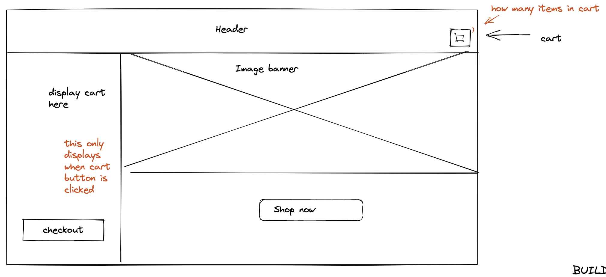
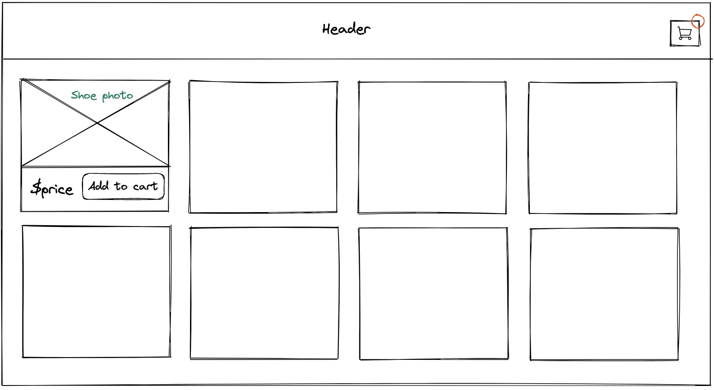
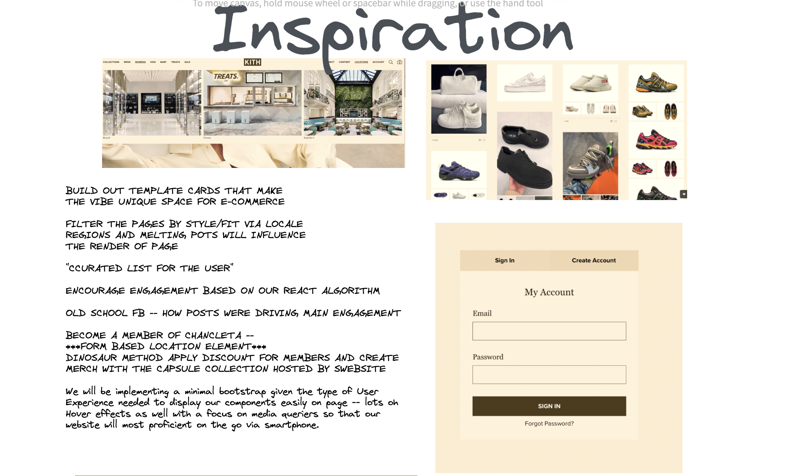
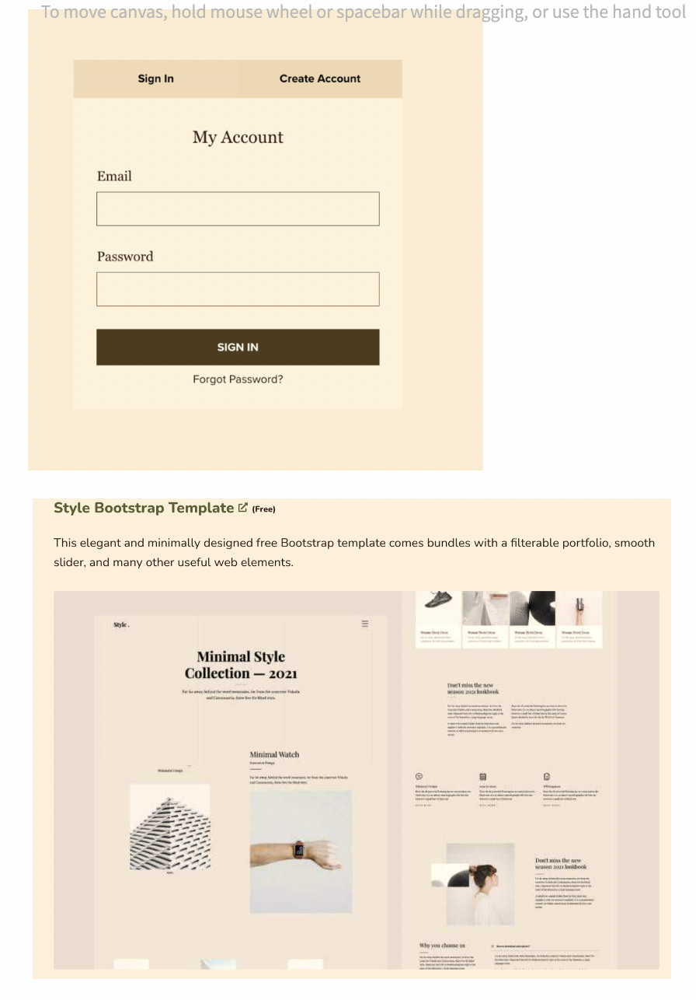
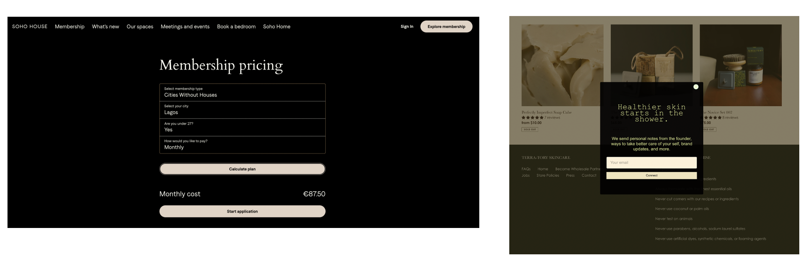

# Chancleta

test

Chancleta is an exclusive club for fashion enthusiasts who want to stay ahead of the latest trends in sneakers and clothing. To join our community, you must receive an invitation from a current member, which will give you access to special insights into fashion trends and exclusive discounts on select items. As a member of Chancleta, you'll be part of an exclusive group of fashion insiders who are always one step ahead of the fashion curve.

Our platform is designed to provide an elevated fashion experience for our members. We offer a carefully curated selection of the latest sneaker releases and clothing styles, tailored to your local fashion scene. Our members have access to exclusive content, including fashion tips and trend reports, and can connect with other like-minded individuals who share their passion for fashion. At Chancleta, we are committed to helping our members look and feel their best, and to providing a truly unique and exclusive fashion club experience.

## All Star Team

| Team Member | Position |
| --- | --- |
| Nina Javier| Lead Developer |
| Christina Cephus |  Developer |
| Diandre Miller | Developer |

 ## Pages:

* Home Page
* Members Only (Secret Page Only members can see)
* About Us
* Contact 
* Reviews

## Features: 

1. Invitation-only access: The website could have a feature that requires a potential member to receive an invitation from an existing member before joining the community.

2. Member profiles: Members could create and customize their profiles, showcasing their personal style and fashion preferences.

3. Curated fashion content: The website could feature a blog or magazine section with articles and editorials about the latest trends, fashion news, and style tips.

4. Exclusive discounts and promotions: Members could receive exclusive discounts and promotions on select items in the Chancleta online store.

5. Personalized recommendations: Based on a member's preferences and location, the website could offer personalized recommendations for sneaker releases and clothing styles.

6. Community forum: A community forum could be implemented for members to connect with each other, share style tips, and discuss the latest trends.

7. Trend reports: The website could feature regular trend reports with insights into what's popular in the fashion industry and what to expect in the future.

8. Local events: Members could be invited to exclusive local events and meetups where they can connect with other members and participate in fashion-related activities.

9. Interactive online store: The website could have an interactive online store where members can browse, purchase, and leave reviews on the latest fashion items.

10. Member feedback and suggestions: The website could have a section for members to provide feedback and suggestions on how to improve the Chancleta fashion club experience.

## Technologies Used:

* React.js
* Bootstrap (Potentially)
* Tailwind CSS (Potentially)

## Installation and Getting Started:

* *npm install* to install any dependencies 
* *npm start* to run react in http://localhost:3000

## Goals:

## Git Commands

* git clone https://github.com/ninajavier/Chancleta to create a copy of a Git repository in a new directory on your local machine.

* git remote add upstream https://github.com/ninajavier/Chancleta (only for the first time): This command sets up a remote connection to the original repository that you forked from. This is only required once when you start working with a new fork.

* git fetch upstream: This command fetches the changes made in the original repository since the last time you fetched changes.

* git checkout main: This command switches to the main branch of your forked repository.

* git merge upstream/main: This command merges the changes from the original repository's main branch into your main branch.

* git checkout <testing_branch>: This command switches to the testing branch where you want to apply the changes.

* git merge main: This command merges the changes from your main branch into your testing branch.

* git add .: This command adds all the changes made in the testing branch to the staging area.

* git commit: This command commits the changes made in the testing branch with a message describing the changes.

* git push: This command pushes the changes made in the testing branch to your GitHub repository.

Make a pull request to the original repository: This step involves going to the original repository and creating a pull request with the changes made in the testing branch of your forked repository. This allows the original repository to review your changes and potentially merge them into their repository.

## Order Of Operations:

1. git fetch upstream (to get all updated changes)
2. Go to your branch
3. Make changes in your branch
4. Add and Commit from your branch
5. git checkout main
6. git pull
7. git checkout <your-branch-name>
8. git merge
9. git merge main

## App Tree Structure:

*To be discussed*

## App Layout: 

## Aesthetics:

## Resources:

*Any links that would be helpful can be added here along with potential dummy APIs*

## Expected Date of Completion:

*September - October 2023*
